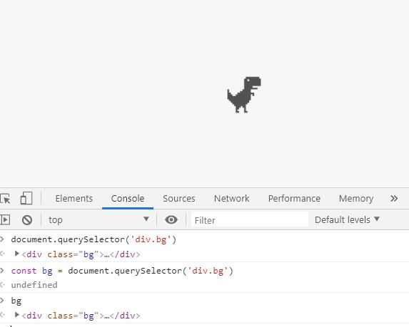
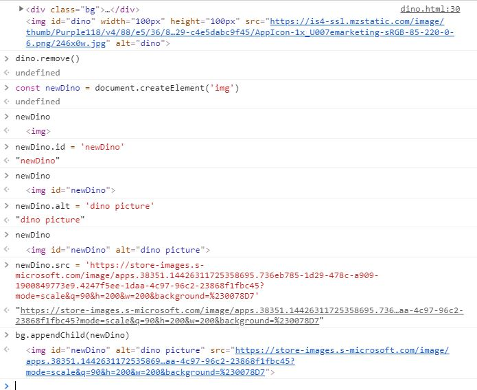
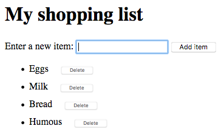

# 자바스크립트

- 자바스크립트(JavaScript)는 객체(object) 기반의 스크립트 언어 

-  HTML로는 웹의 내용을 작성하고, CSS로는 웹을 디자인하며, 자바스크립트로는 웹의 동작을 구현 가능

- 브라우저가 없으면 존재할 수 없는 언어이다.
- HTML에 종속되어있다.


### 자바스크립트 언어의 특징

1. 자바스크립트는 객체 기반의 스크립트 언어

2. 자바스크립트는 동적이며, 타입을 명시할 필요가 없는 인터프리터 언어

3. 자바스크립트는 객체 지향형 프로그래밍과 함수형 프로그래밍을 모두 표현

- node.js 를 통해서 python처럼 Javascript를 사용 가능


 http://tcpschool.com/javascript/intro 

### Dom

- **문서 객체 모델**(**Document Object Model**, **DOM**)은 [HTML](https://developer.mozilla.org/ko/docs/HTML) 및 [XML](https://developer.mozilla.org/ko/docs/XML) 문서를 처리하는 API 


```js
// 보고있는 브라우저에 대한 innerwidth 정보를 제공
window.innerWidth
526
window.innerWidth
658

// window라는 것을 사용해서 브라우저에게 명령
window.print()
undefined
```


```js
// console 창 reset
ctrl + l 


document.title
"코딩의 시작, TCP School"

// 아래와 같이 조작 가능
document.title = "안녕"
"안녕"

document.title
"안녕"

var y = 10
var x = 10
x = x + y
20

```


## 환경설정

```json
1. 
ctrl+shift+p
settings(JSON)

"[javascript]":{
    "editor.tabSize": 2
}
추가


2.
ctrl+.
Text Editor에서 Detect Indentation off

3. live server extensions 설치


4. live server open후 ctrl+shift+I
js console 
```


```js
let y = 2
undefined // 반환 값, 선언식

```


- 자바스크립트에서 모든 언어 선언은 한번만 가능하고(재선언불가) 재할당만 가능하다.

```js
    // let은 값을 재할당 할 수 있는 변수를 선언하는 키워드
    let x = 1
    
    // 재할당한다 == 다시 할당 할 수 있다.
    // 아래와 같이 let으로 선언을 한 것을 재할당만 가능하다 == 자바스크립트에서 모든언어는 재선언을 할 수 없다.
    x = 3
```


```html
==  Equal Operator
=== Strict Equal Operator
strict는 엄격한 이라는 의미로 좀더 엄격하게 같은지를 보는 연산자


=는 만약 a=b이라고 했을때, b를 a에 대입해서, 지금부터 a가 b이라고 약속
지금부터 너는 졸업생이야는 you = "졸업생"이라고 할 수 있습니다.


==는 먄약 a==b이라고 했을때, 
a가 b과 '값'이 같은지를 판단해서 맞으면 true, 틀리면 false라고 합니다.


===는 만약 a===b이라고 했을때, 
a가 b과 '값'과 '타입/형식?'이 정확하게 같은지를 판단해서 true/false를 표현합니다.

===를 좀더 자세히 설명하면
값이라는 의미는 1이라는 데이터는 역시 1

형식이라는 의미는 javascript가 똑똑하게도 숫자1과 문자"1"을 1이라는 데이터로 인식할 수 있기때문에, 문자와 값의 형식조차 완벽히 같아야만 true라고 판단(리턴)

예를들어
1=="1"은 true이지만,
1==="1"은 false입니다.


또,
null과 undefined는 값이 없다는 의미의 데이터 형
null은 값이 없음을 명시적으로 표시한 것이고, 
undefined는 그냥 값이 없는 상태이기때문에, 
==로는 true가 뜨지만, ===로는 false가 리턴
==보다는 ===를 사용해야 한다고 강하게 추천
이유는 역시 조건문이나, 좀더 복잡한 상황의 프로그래밍에서 차이가 나온다 
```


### Dom Tree

document.querySelector() 로 특정 element를 select한다.

> #아이디선택

>  .클래스선택

>  '빈공간'태그선택

console에서 아래와 같이 bg라는 변수에 해당 query를 담을 수 있다.

이 뜻은 모든 element는 querySelector을 갖고있다는 뜻


```html
<!DOCTYPE html>
<html lang="en">
  <head>
    <meta charset="UTF-8" />
    <title>Document</title>
    <style>
      .bg {
        background-color: #f7f7f7;
        display: flex;
        justify-content: center;
        align-items: center;
        min-height: 100vh;
      }
    </style>
  </head>
  <body>
    <div class="bg">
      
    </div>

    <script>
      const bg = document.querySelector('div.bg')
      const dino = document.querySelector('#dino')
      console.log(bg, dino)
    </script>
  </body>
</html>
```




변수의 property를 이런식으로 가져올 수 있다.

ctrl+l -> clear

```js
> dino.src
> "https://is4-ssl.mzstatic.com/image/thumb/Purple118/v4/88/e5/36/88e536d4-8a08-7c3b-ad29-c4e5dabc9f45/AppIcon-1x_U007emarketing-sRGB-85-220-0-6.png/246x0w.jpg"

-- 아래와 같이 속성값을 바꿔줄 수 있다.
> dino.src = 'https://store-images.s-microsoft.com/image/apps.38351.14426311725358695.736eb785-1d29-478c-a909-1900849773e9.4247f5ee-1daa-4c97-96c2-23868f1fbc45?mode=scale&q=90&h=200&w=200&background=%230078D7'
```


style로 바로 접근하여 element를 바꿀 수 있다.

```js
> dino.style.width = '500px'
> "500px"

> dino.style.height = '500px'
> "500px"
```


### 삭제

1. 대상을 직접 삭제

- element.remove() 

```js
> dino.remove()
> undefined
```


2. 삭제

- document.querySelector('element').remove()

```js
> document.querySelector('#dino').remove()
> undefined
```


3. 대상의 자식 요소 삭제

- element.firstElementChild.remove()

```js
-- 모든 자식 삭제
> bg.firstElementChild.remove()
> undefined
```

```js
-- 특정 자식 삭제
> bg.removeChild(bg.firstElementChild)

> bg.removeChild(bg.lastElementChild)

> bg.removeChild(dino)
```

```js
-- 삭제 후
> bg.removeChild(dino)
-- null 반환
> bg.firstElementChild
> null
```


### 생성 및 대상에 요소 추가





## My shopping list




```js
const h1 = document.querySelector('h1')
// h1.innerText
// h1.innerText = '바꾸기'
// <h1> innerText </h1>

const input = document.querySelector('input')
const ul = document.querySelector('ul')
const button = document.querySelector('button')
input.value // 들어온 값 출력 가능


button.addEventListener('click', (event) => {
    const li = document.createElement('li')
    li.innerText = input.value

    const deleteButton = document.createElement('Button')
    deleteButton.innerText = '삭제'
    li.appendChild(deleteButton, li.deleteButton)
    ul.insertBefore(li, ul.firstElementChild)

    deleteButton.addEventListener('click', (event) => {
      li.remove()
    })
})
```


## [Node.js]( https://nodejs.org/ko/ )


#### 설치

 Node.js를 다운 받고 bash에서 아래와 같이 확인되면 설치 완료

```bash
student@M702 MINGW64 ~/development/Javascript (master)
$ node -v
v12.13.0

student@M702 MINGW64 ~/development/Javascript (master)
$ npm -v
6.12.0

```


#### Node.js 란?

```bash
student@M702 MINGW64 ~/development/Javascript/notes (master)
$ node test.js
123123
```

위와같이 Javascript가 브라우저 환경에서 벗어나서 bash/terminal에서 python 처럼 확인 가능

때문에 브라우저에 종속되어있는 반쪽짜리 언어가 아니게 되었다.

서버도 만들고, html도 만들고,, 풀스택 가능


[npm](https://www.npmjs.com/ ) :  Node.js에서 package를 관리해주는 manager


non blocking 하다 : 비동기적으로 처리하다

call back 함수를 많이 쓰게될 것


####  **메모리 힙(Memory Heap)**  이란?

객체는 힙, 대부분 구조화되지 않은 메모리 영역에 할당된다. 변수와 객체에 대한 모든 메모리 할당은 여기서 발생한다. 


#### 호출스택(Call Stack) 이란? [관련문서](https://new93helloworld.tistory.com/358)

코드가 실행될 때 호출 스택이 쌓인다. 

우리가 어디에 있는지를 기본적으로 기록하는 데이터 구조

> 동작 방식

1. 함수를 실행하면 해당 함수의 기록을 스택 맨 위에 추가(Push) 합니다. 
2. 우리가 함수를 결과 값을 반환하면 스택에 쌓여있던 함수는 제거(Pop) 됩니다.  

 https://joshua1988.github.io/tech/ 

| 호출순   | 함수이름 | 실행순   |
| -------- | -------- | -------- |
| 함수1    | 함수1    | 함수5    |
| 함수2    | 함수2    | 3초함수4 |
| 함수3    | 함수3    | 함수3    |
| 3초함수4 | 3초함수4 | 함수2    |
| 함수5    | 함수5    | 함수1    |
|          |          | 3초함수4 |


#### XMLHttpRequest(XHR)

Javascript가 가지는 객체

전체 페이지의 새로고침없이도 URL 로부터 데이터를 받아올 수 있다. 


 https://jsonplaceholder.typicode.com/posts/1 

```js
> const XHR = new XMLHttpRequest()
> undefined
> const url = 'https://jsonplaceholder.typicode.com/posts/1'
> undefined
> XHR.open('GET', url)
> undefined

> XHR.addEventListener('load', function(event) {
    console.log(event)
})
> undefined
> XHR.send()
> undefined
> VM623:2 ProgressEvent {isTrusted: true, lengthComputable: false, loaded: 292, total: 0, type: "load", …}

-- 응답받은 json 타입의 객체
bubbles: false
cancelBubble: false
cancelable: false
composed: false
currentTarget: XMLHttpRequest {onreadystatechange: null, readyState: 4, timeout: 0, withCredentials: false, upload: XMLHttpRequestUpload, …}
defaultPrevented: false
eventPhase: 0
isTrusted: true
lengthComputable: false
loaded: 292
path: []
returnValue: true
srcElement: XMLHttpRequest {onreadystatechange: null, readyState: 4, timeout: 0, withCredentials: false, upload: XMLHttpRequestUpload, …}
target: XMLHttpRequest {onreadystatechange: null, readyState: 4, timeout: 0, withCredentials: false, upload: XMLHttpRequestUpload, …}
timeStamp: 298999.11499998416
total: 0
type: "load"
__proto__: ProgressEvent
```


**axios** 설치 : Javascript로 요청을 보내는 library

```bash
$ npm install axios
```


package.json 생성 (프로젝트 매니저)

```bash
npm init
-- 모두 enter
```


.gitignore

```bash
vi .gitignore

node_modules/ 등록


node_modules 삭제 후 npm install 하면 모두 깔림
```


#### web API 사용을 도와주는 axios 사용

```js
const axios = require('axios')

const url = 'https://jsonplaceholder.typicode.com/posts/1'


// 아래와 같이 call back 함수 
axios.get(url)
.then(function(response) {
  console.log(response.data)
  // console.log(response)
})
```

```bash
student@M702 MINGW64 ~/development/Javascript/notes (master)
$ node 02_axios_node.js
{
  userId: 1,
  id: 1,
  title: 'sunt aut facere repellat provident occaecati excepturi optio reprehenderit',
  body: 'quia et suscipit\n' +
    'suscipit recusandae consequuntur expedita et cum\n' +
    'reprehenderit molestiae ut ut quas totam\n' +
    'nostrum rerum est autem sunt rem eveniet architecto'
}
```


#### 페이지 전환 없이 요청을 보내서 응답받은 데이터로 페이지 조작

```js
<!DOCTYPE html>
<html lang="ko">
<head>
 <meta charset="UTF-8">
 <meta name="viewport" content="width=device-width, initial-scale=1.0">
 <meta http-equiv="X-UA-Compatible" content="ie=edge">
 <script src="https://unpkg.com/axios/dist/axios.min.js"></script>
 <title>개랑 고양이</title>
</head>
<body>
 <h1>댕댕이</h1>
 <button>Add Dog</button>
 <div class="animals"></div>
 
 <script>
   const API_URL = 'https://dog.ceo/api/breeds/image/random'
  
   const button = document.querySelector('button')

  button.addEventListener('click', (event) => {
  // getDogImage함수를 실행 시킬때마다 새롭게 push 해줄것
   const getDogImage = function() {
   // Axios 를 통해 댕댕이 사진을 달라는 요청을 보낸다
   axios.get(API_URL)
     // 그리고 요청이 도착하면, 함수를 실행한다
     .then(function(response) {
       // 응답받은 데이터에서 댕댕이 이미지 url 을 꺼낸다
       const imageUrl = response.data.message
       // 댕댕이 이미지를 화면에 표현하기 위한 이미지 태그를 생성한다
       const dogImage = document.createElement('img')
       dogImage.src = imageUrl
       dogImage.alt = 'dog'
       // div.animals 안에 이미지 태그를 push 한다
       const animalsList = document.querySelector('div.animals')
       animalsList.appendChild(dogImage)
     })
    }
    console.log(getDogImage())
  })
 </script>
</body>
</html>
```


#### django: Axios 적용

