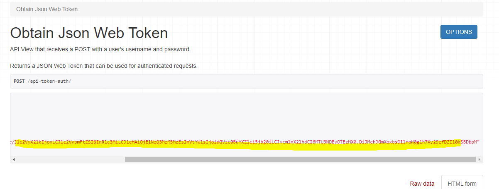
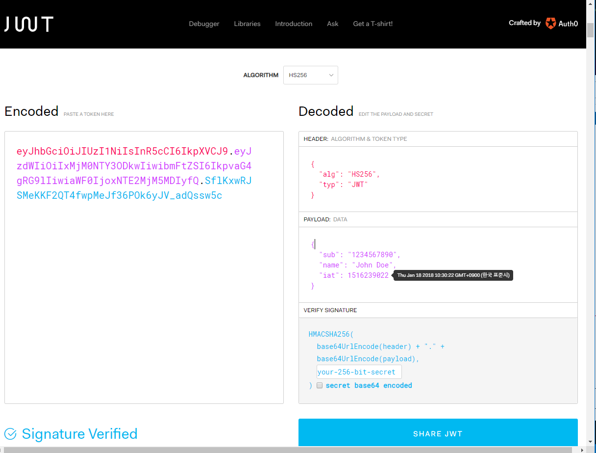
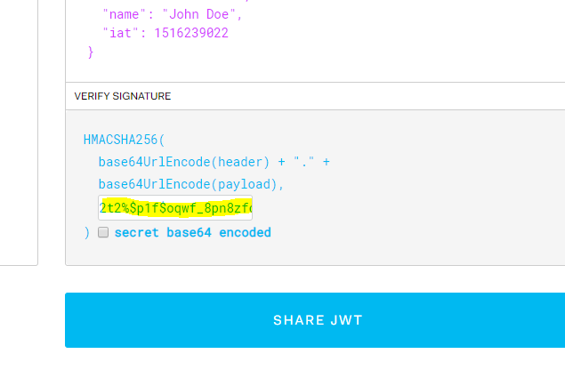
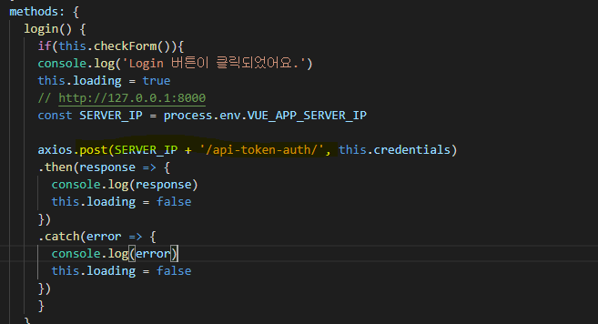
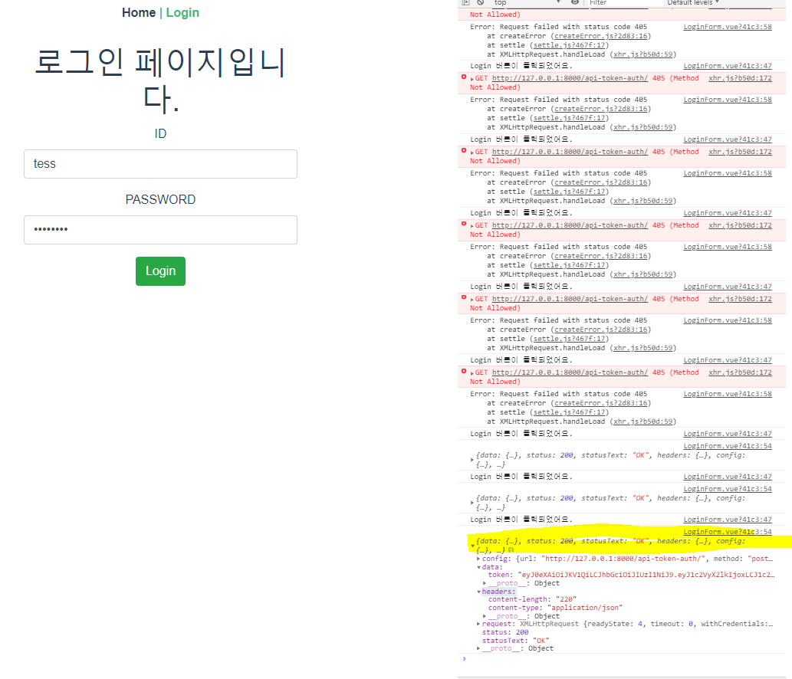
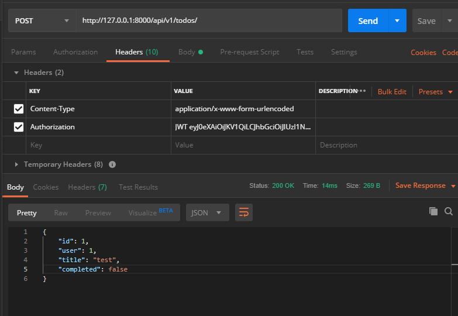

[toc]

# todo-back(django)

 https://dev-yakuza.github.io/ko/django/jwt/ 

```bash
$ pip install djangorestframework
$ pip install djangorestframework-jwt
$ pip install django-cors-headers
```

```python
# settings.py     
# third party apps 등록
    'rest_framework',
    'corsheaders',

# django_jwt
REST_FRAMEWORK = {
    'DEFAULT_PERMISSION_CLASSES': (
        'rest_framework.permissions.IsAuthenticated',
    ),
    'DEFAULT_AUTHENTICATION_CLASSES': (
        'rest_framework_jwt.authentication.JSONWebTokenAuthentication',
        'rest_framework.authentication.SessionAuthentication',
        'rest_framework.authentication.BasicAuthentication',
    ),
}


JWT_AUTH = {
    'JWT_SECRET_KEY': SECRET_KEY,
    'JWT_ALGORITHM': 'HS256',
    'JWT_ALLOW_REFRESH': True,
    'JWT_EXPIRATION_DELTA': datetime.timedelta(days=7),
    'JWT_REFRESH_EXPIRATION_DELTA': datetime.timedelta(days=28),
}
```


 https://swalloow.github.io/implement-jwt 

 https://jwt.io/ 





django settings.py 내의 SECRET_KEY를 추가하여 확인




# todo-front(vue)

 https://bootstrap-vue.js.org/ 

```bash
> npm install vue bootstrap-vue bootstrap
```

 https://bootstrap-vue.js.org/docs 의 내용 추가


**npm run serve/ python manage.py runserver** 이 된 상태에서,

로그인 정보를 서버에서 넘겨주도록 하여 다음과 같이 front 에서 수정






 https://lovemewithoutall.github.io/it/vue-login-demo/ 

 https://www.npmjs.com/package/vue-session 

```bash
# /Vue_Django/todo-front
$ npm i vue-session
```


사용자의 로그인 상태에 따라서 **조건부 랜더링**

JWT 인증키




decoding해주는 library

```bash
$ npm i jwt-decode
```


