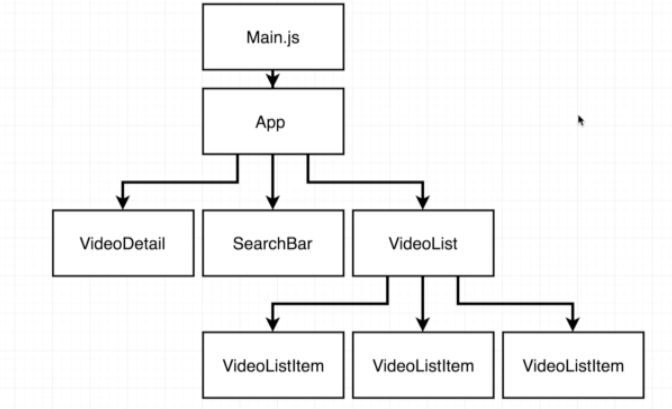
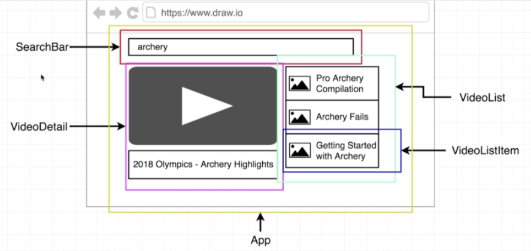
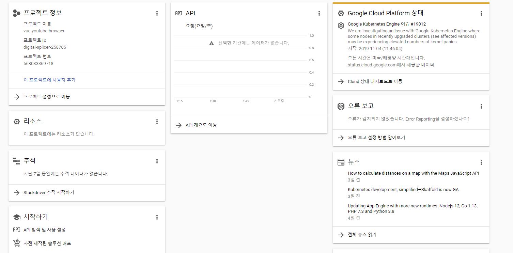
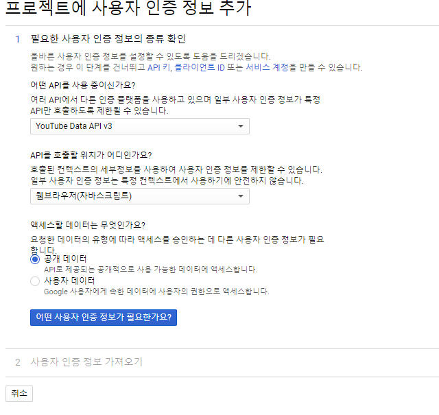

# FrontEnd: Vue js

 https://kr.vuejs.org/v2/guide/index.html 

**SPA** : **S**ingle **P**age **A**pplication

-   데이터와 DOM이 연결되어 이제 모든 것이 **반응형**이 된다.
- page가 loading되지 않고, binding 한 부분만 실시간으로 data가 바뀌게 즉각적으로 조작할 수 있다.

- page를 전체 다 바꾸는 것이 아니라 source가 되는 부분만 바꾼다. 때문에 바뀌지 않는 부분에 대한 낭비가 없다.


**Vue.js devtools**

 https://chrome.google.com/webstore/detail/vuejs-devtools/nhdogjmejiglipccpnnnanhbledajbpd 


```js
> app.$data.message
> "Hello, Vue!"
> app.message
> "Hello, Vue!"
// plus method 가 실행되면서 브라우저화면의 count가 늘어난다
> app.plus()
> undefined
```


Vue.component란

- 기본 HTML 엘리먼트를 확장하여 재사용 가능한 코드를 캡슐화하는데 도움
- 상위 수준에서 컴포넌트는 Vue 컴파일러에 의해 동작이 추가된 사용자 지정 엘리먼트
- 특변한 `is` 속성으로 확장된 원시 HTML 엘리먼트로 나타낼 수 있다.


### 전역등록

```html
<!DOCTYPE html>
<html lang="en">
<head>
  <meta charset="UTF-8">
  <meta name="viewport" content="width=device-width, initial-scale=1.0">
  <meta http-equiv="X-UA-Compatible" content="ie=edge">
  <title>Document</title>
</head>
<body>
  <div id="examp">
<todo-list></todo-list>
  </div>


  <script>
  
  Vue.component('todo-list', {
    template: '<div>사용자 정의 컴포넌트 입니다.</div>'
  })

  new Vue({
    el: '#examp'
  })

  </script>


</body>
</html>
```


아래와 같이 rendering 되는것을 확인할 수 있다.

```html
<div id="example">
  <div>사용자 정의 컴포넌트 입니다!</div>
</div>
```


### Module Bundler: Webpack

https://webpack.js.org/

 웹팩은 오픈 소스 자바스크립트 **모듈 번들러**이다. 주로 자바스크립트를 위한 모듈 번들러이지만 호환 플러그인을 포함하는 경우 HTML, CSS, 심지어는 이미지와 같은 프론트엔드 자산들을 변환할 수 있다. 웹팩은 의존성이 있는 모듈을 취하여 해당 모듈을 대표하는 정적 자산들을 생성한다. 


[02_vue_webpack_cli]()

브라우저 환경의 js에서 벗어나서 nodejs에서 작업 시작

```bash
# 1. node project 시작
$ npm init

{
  "name": "02_vue_webpack_cli",
  "version": "1.0.0",
  "description": "webpack으로 vue설정",
  "main": "index.js",
  "scripts": {
    "test": "echo \"Error: no test specified\" && exit 1"
  },
  "keywords": [
    "tess"
  ],
  "author": "",
  "license": "ISC"
}
# package.json이 생성되는데, project의 기본 설정이 담긴 파일이다.

# 2. vue 설치
$ npm install vue # === "npm i vue"
# vue라는 library가 설치된다.

# 3. .gitignore 파일 생성하여 node_modules/ 작성


# 4. Webpack 설치
# -D 는 개발환경에서만 사용하겠다는 option
# webpack은 개발자의 편의성을 위한 tool
$ npm i -D webpack webpack-cli


# 5. webpack 설정파일 생성
# webpack에 해당하는 js파일 생성
$ touch webpack.config.js
# webpack.config.js에 webpack을 어떻게 사용할 건지 작성해야 한다.
# 작성방법: https://webpack.js.org/concepts/
```


6. webpack.config.js에 아래와 같이 작성

```js
const path = require('path')
const VueLoaderPlugin = require('vue-loader/lib/plugin') // module.exports랑 한세트

// nodejs에서는 module에서 특정 값을 exports하기 위해서
// 아래와 같이 module.exports에 export 할 값들을 정의한다.
module.exports = {
  mode: 'development', // 상업용은 production
  // entry: 모든 파일들의 시작점
  entry: {
    // __dirname => 현재 폴더의 이름을 가지고 있다. (최상위 위치:Django의 BASE_DIR과 유사)
    app: path.join(__dirname, 'src', 'main.js'),
  },
  // module: webpack은 기본적으로 js만 변환가능, 따라서 css나 html등은
  // 모듈을 통해서 webpack이 이해할 수 있도록 변환이 필요하다.
  // 변환 내용을 작성하는 곳
  module: {
    rules: [
        {
        test: /\.vue$/,
        use: 'vue-loader',
      },
      {
        test: /\.css$/,
        use: ['vue-style-loader', 'css-loader'],
      }
    ]
  },
  // plugins: webpack을 통해서 번들된 결과를 추가 처리하는 부분
  plugins: [
    new VueLoaderPlugin(),
  ],
  // output: webpack을 통해서 번들된 결과물이 정의되는 부분
  // 어떻게 output이 될 것인가?
  output: {
    filename: 'app.js',
    path: path.join(__dirname, 'dist'),
  },
}
```


7. src 폴더 생성 

8. src 폴더 안에 
   - main.js 파일 생성
   
      https://css-tricks.com/what-does-the-h-stand-for-in-vues-render-method/ 
     
      https://webpack.js.org/concepts/ 
     
     main.js에 아래와 같이 작성
   
   ```js
   // Vue라는 library를 node modules에 설치해서 위와같이 선언가능
   import Vue from 'vue'
   // 현재 폴더에 있는 App.vue를 가져온다.
   import App from './App.vue'
   
   new Vue({
     render: function(createElement) {
       return createElement(App)
     }
     // 아래와 같이 사용가능
     // render: (h) => h(App)
   }).$mount('#app') // 새로운 vue instance(project)를 만들겠다는 선언
   ```
   
   - App.vue 파일 생성 
   
     : App.vue는 가장 최상위의 root가 된다.
   
     **vetur** extensions 설치
   
   ```vue
   
   <template>
   <h1>여기가 바로 최상위 컴포넌트</h1>
   
   </template>
   
   ```
<script>
   export default {

   }
   </script>

   <style>

   </style>

   ```
   
   
   
9. settings.json 설정 (ctrl+shift+p) 후 추가

​```json
{
    "window.zoomLevel": 0, 
    "terminal.integrated.shell.windows": "C:\\Program Files\\Git\\bin\\bash.exe",
    "workbench.iconTheme": "vscode-icons",
    "workbench.activityBar.visible": true,
    "editor.minimap.enabled": false,
    "[html]": {
        "editor.tabSize": 2
    },
    "[css]": {
        "editor.tabSize": 2
    },
    "liveServer.settings.donotShowInfoMsg": true,
    "[javascript]":{
        "editor.tabSize": 2
    },
    "[vue]":{
        "editor.tabSize": 2
    },
}
   ```

```bash
# 10. vue-loader vue-template-complier 설치
# webpack은 기본적으로 js파일만 변환 가능
# 때문에 vue 파일 및 template를 webpack이 변환할 수 있도록 도와주는 라이브러리
$ npm install -D vue-loader vue-template-complier
```


11. package.json에서 test 부분을 지운다

    ```json
    {
      "name": "02_vue_webpack_cli",
      "version": "1.0.0",
      "description": "webpack으로 vue설정",
      "main": "index.js",
        -- 추가
      "scripts": {
        "build": "webpack"
      },
      "keywords": [
        "tess"
      ],
      "author": "",
      "license": "ISC",
      "dependencies": {
        "vue": "^2.6.10"
      },
      "devDependencies": {
        "vue-loader": "^15.7.2",
        "vue-template-compiler": "^2.6.10",
        "webpack": "^4.41.2",
        "webpack-cli": "^3.3.10"
      }
}
    ```
    
    

12.

```bash
# 아래와 같이 시작할 수 있다
$ npm run build
# 아래를 설치하여 CSS를 작동가능하게 한다.
# 이후 webpack.config.js에서 rules에 추가
$ npm install vue-style-loader css-loader -D
```


13. 문제가 생기면 node_modules/ 를 삭제하고, bash에 npm i를 선언한다.


## Youtube-browser 만들기

- youtube에 검색 요청 후 데이터 받아오기

### vue cli 설치

```bash
$ npm install -g @vue/cli
# 설치 후
$ vue --version
@vue/cli 4.0.5
```

### vue cli 시작

```bash
$ vue create youtube-browser
```

```bash
# 생성한 프로젝트인
# youtube-browser/ 에서 진행해야 한다.
# 시작
$ npm run serve
$ npm run build
# ESLint 로 협업
$ npm run lint
```





```json
// package.json
    "rules": {
      "no-console": "off"
    },

// 추가 후 server를 닫고 다시 열기
```


App 함수를 만들어서

searchbar한테 실행시키라고 함 

### google API Dashboard

http://console.developers.google.com/ 

새프로젝트 생성

 https://console.developers.google.com/home/dashboard?project=digital-splicer-258705&organizationId=0 



[](https://console.developers.google.com/apis/api/youtube.googleapis.com/overview?organizationId=0&project=digital-splicer-258705)

[ API 및 서비스 ](https://console.developers.google.com/apis?organizationId=0&project=digital-splicer-258705) YouTube Data API v3

create credential



```bash
# API의 response를 받기위해 설치
$ npm install axios
```

 https://developers.google.com/youtube/ 

 

video list 를 받아 component화 시키기


data-data-items-arrays 비디오에 대한 정보

상위 -> 하위 props로 넘긴다.

그래서 하위에 props로 등록해줘야 한다.